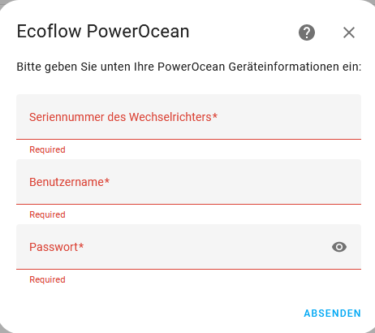
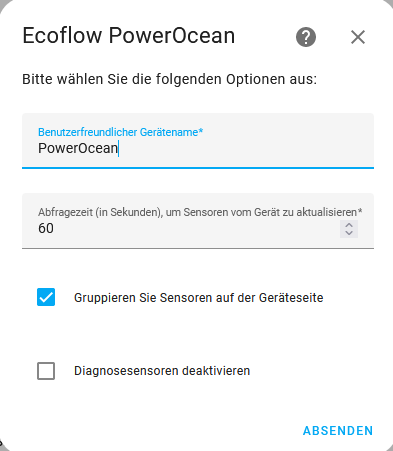
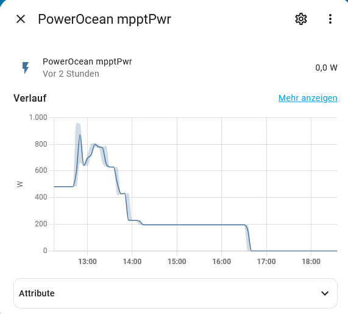

<!-- prettier-ignore -->
# Ecoflow PowerOcean

[Home Assistant](https://home-assistant.io/) custom component to get access to my PowerOcean system from EcoFlow.

This component was inspired by [tolwi/hassio-ecoflow-cloud](https://github.com/tolwi/hassio-ecoflow-cloud) and is a copy of [evercape/hass-resol-KM2](https://github.com/evercape/hass-resol-KM2).  

Temporary quick solution to my problem.
I hope of an integrate PowerOcean into [tolwi/hassio-ecoflow-cloud](https://github.com/tolwi/hassio-ecoflow-cloud) with an official API.

Hopefully it works for others.

## Prerequisites

I have tested the component with my System.
I use the Android App and the Webportal at https://portal.ecoflow.com/user/eu/de/login

You need the S/N number of your inverter and your credentinals

## Installation

- Install as a custom repository via HACS
- Manually download and extract to the custom_components directory

Once installed, use Add Integration -> Ecoflow PowerOcean.

## Configuration

Follow the flow.





### Sensors
Sensors are registered to each device as `sensor.{name}_{serial}_{sensor_name}` with an friendly name of `sensor_name`. Additional attributes are presented on each sensor:
- Product Description, Destination Name, Source Name: internal names
- Internal Unique ID: `{serial}_{sensor_name}`
- Device Name: as
- Vendor Product Serial: serial number of the PowerOcean inverter
- Vendor Firmware Version: 5.1.8
- Vendor Product Build: 13
  



## Troubleshooting
Please set your logging for the this custom component to debug during initial setup phase. If everything works well, you are safe to remove the debug logging:

```yaml
logger:
  default: warn
  logs:
    custom_components.powerocean: info
```

## Credits

Thanks to my kollege David for giving me a start point.

And also thanks for the great work of the team from homeassistant and the great community.